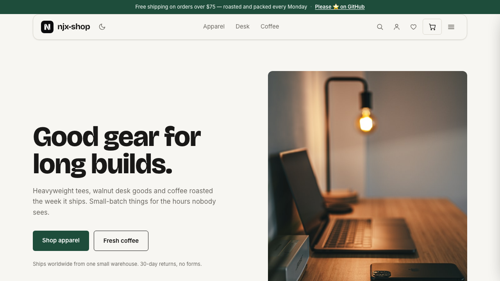
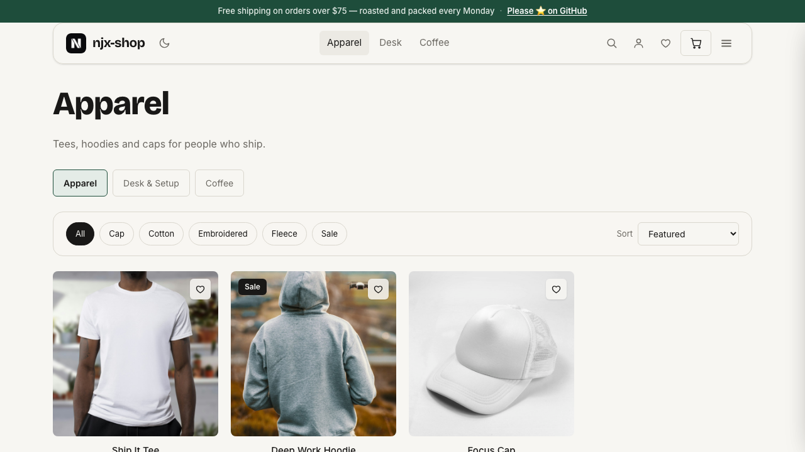
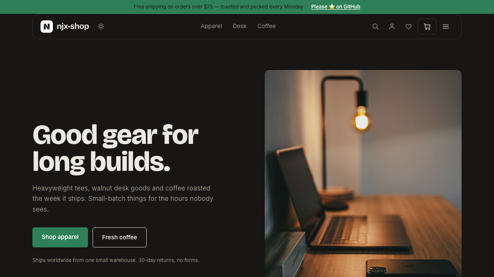

# njx-store — free ecommerce theme for Astro

A complete, ready-to-ship online store built with **Astro 5 + Tailwind CSS v4**, wired for
**Shopify** out of the box and deployable to **Cloudflare Pages** (or any static host) in minutes.

**Live demo → [astro-njx-store.pages.dev](https://astro-njx-store.pages.dev)**
Everything in the demo — cart, checkout, search, favorites, dark mode — is this theme running on mock data.



## What is this?

njx-store is a **static storefront**: Astro renders every page to plain HTML at build time,
so the site is fast by default and hosting is essentially free. Product data comes from a
pluggable provider — start with the bundled JSON catalog, then flip one environment variable
and the same pages build from your **real Shopify store**, with Shopify's hosted checkout
handling payments.

Use it when you want a fast custom storefront without running a server, paying for a
heavyweight theme, or building cart logic from scratch.

## Features

- 🛍 **Full store flow** — home, collections with client-side filters & sorting, product pages
  with variants, gallery + lightbox, related products
- 🛒 **Working cart** — persistent (localStorage), quick-add from product cards, quantity
  controls, line remove, clear all; hands off to Shopify's hosted checkout
- 🔌 **Two data providers, one switch** — `COMMERCE_PROVIDER=mock` (bundled JSON, no accounts
  needed) or `shopify` (live products over the Storefront API)
- 🔎 **Instant search** — inline index, opens with `/`, zero network requests
- ❤️ **Favorites** — heart any product, badge counter, dedicated `/favorites` page
- 🌗 **Light & dark theme** — one click, no flash on reload
- 📄 **18 pages total** — about, contacts, FAQ, account (sign in / create account UI),
  privacy, terms, honest 404
- 📱 **Responsive** — floating card header/footer, drawer cart & menu on mobile
- ⚡️ **Zero client framework** — a few small vanilla scripts; no React/Vue/hydration cost

| Light | Dark |
| --- | --- |
|  |  |

## Quick start

```bash
git clone https://github.com/njbSaab/astro-njx-store.git my-store
cd my-store
npm install
cp .env.example .env        # defaults to the mock catalog
npm run dev                 # http://localhost:4321
```

That's it — the store runs on the bundled demo catalog (`src/data/mock-catalog.json`).
Edit that file to see your own products immediately.

## Connect your Shopify store

1. In Shopify admin: **Settings → Apps and sales channels → Develop apps → Create an app.**
2. Give it the *Storefront API* scopes (unauthenticated read products/collections/checkouts).
3. Install the app and copy the **Storefront API access token** (this token is public-safe).
4. Update `.env`:

```bash
COMMERCE_PROVIDER=shopify
PUBLIC_SHOPIFY_DOMAIN=your-store.myshopify.com
PUBLIC_SHOPIFY_STOREFRONT_TOKEN=xxxxxxxxxxxxxxxx
```

5. `npm run build` — the same pages now build from your live catalog, and the cart button
   creates a real Shopify cart and redirects to your hosted checkout.

The provider interface lives in `src/lib/commerce/` — adding WooCommerce, Medusa or your own
API means implementing one small TypeScript interface.

## Deploy

Any static host works. For Cloudflare Pages:

```bash
npm run build
npx wrangler pages deploy dist --project-name my-store
```

Set the same env vars in your host's dashboard for CI builds. The whole store fits
comfortably in Cloudflare's free tier.

## Make it yours

- **Brand & colors** — design tokens in `src/styles/global.css` (`@theme` block, dark
  overrides in `.dark`). Swap the two logo files in `public/logo/`.
- **Catalog** — `src/data/mock-catalog.json` + photos in `public/products/`, or connect Shopify.
- **Copy & pages** — plain `.astro` files in `src/pages/`, one component per section.
- **Layout** — header, footer, cart drawer, search and menu all live in `src/layouts/Layout.astro`.

## Project structure

```
src/
├── data/mock-catalog.json      # demo products & collections
├── layouts/Layout.astro        # header, footer, cart/nav drawers, search
├── components/ProductCard.astro
├── lib/
│   ├── commerce/               # provider interface + mock & shopify implementations
│   ├── cart.ts                 # persistent cart (nanostores)
│   └── favorites.ts            # persistent favorites
└── pages/                      # index, collections/, products/, about, faq, …
```

## Lite vs Pro

This is **njx-store Lite** — free, MIT-licensed, complete and production-usable.
**Pro** (extended sections, more page templates and priority support) is on the way —
[watch the repo](https://github.com/njbSaab/astro-njx-store) to get notified.

## Credits

Made by [njX](https://njxui.dev) — also the author of [njx-ui](https://njxui.dev), a
classless-friendly CSS library for landings. Product photos: [Unsplash](https://unsplash.com).

If this theme saves you time, a ⭐️ on GitHub genuinely helps it reach more people.
